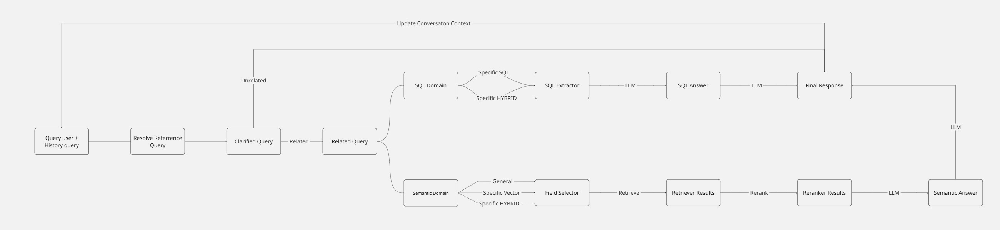
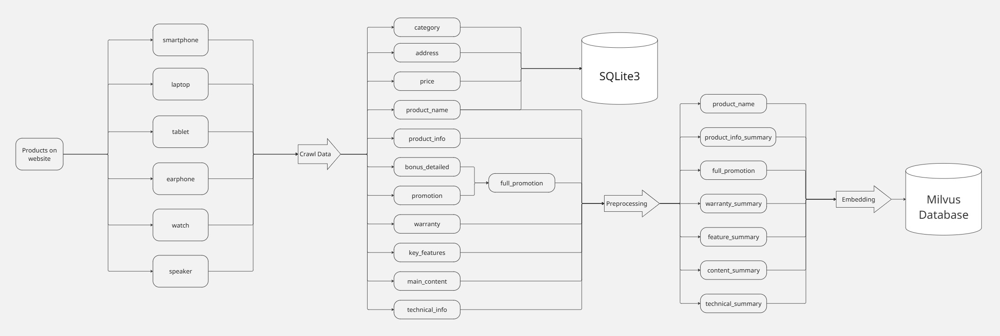
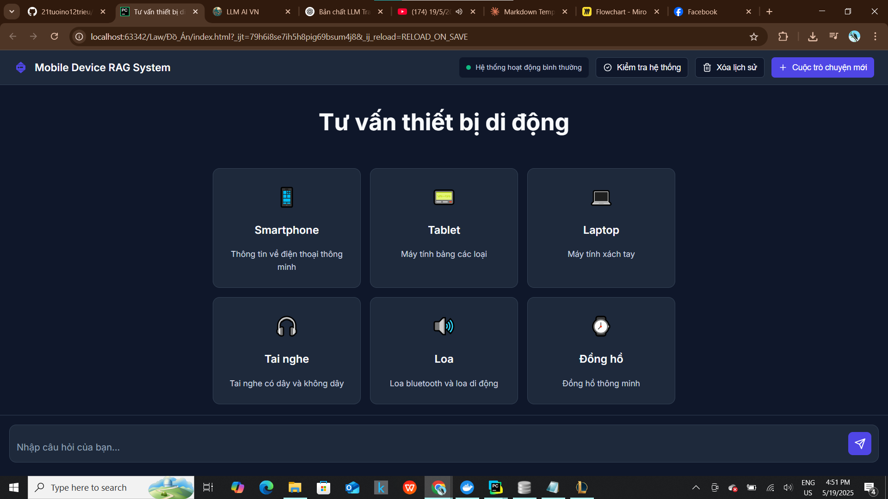
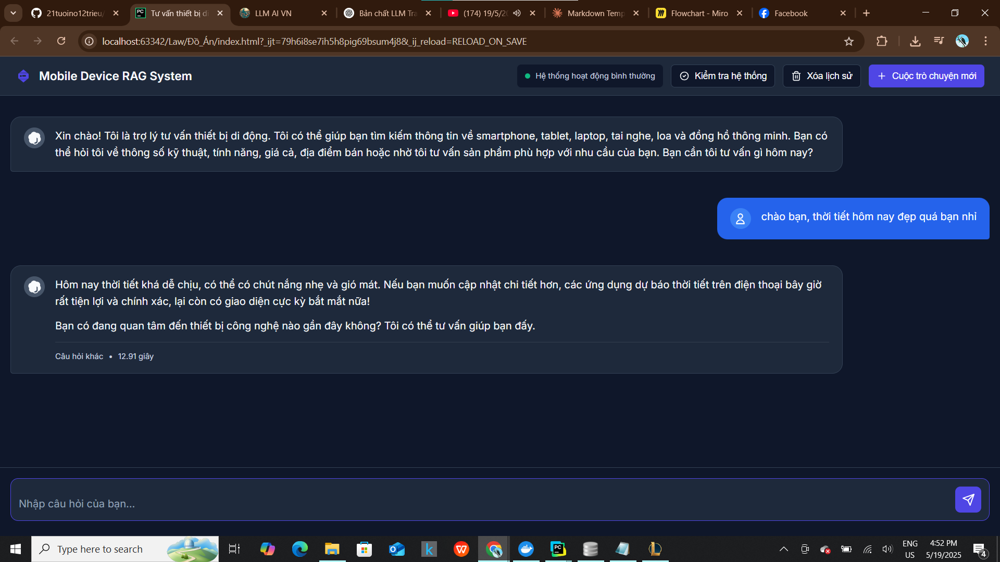
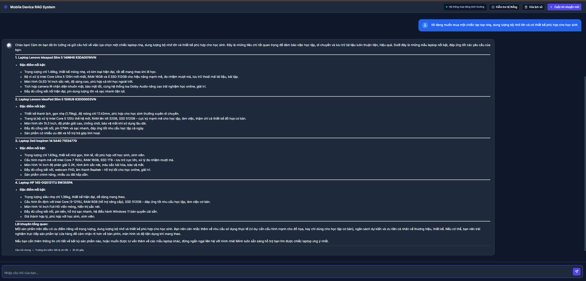

# Hệ thống RAG - Product Information Retrieval and QA System


Hệ thống RAG (Retrieval Augmented Generation) được thiết kế để thu thập, xử lý và truy xuất thông tin sản phẩm từ các trang thương mại điện tử, cung cấp khả năng hỏi đáp thông minh về các sản phẩm.

## 📋 Tổng quan về Workflow của Hệ thống RAG


Hệ thống được xây dựng dựa trên một quy trình RAG toàn diện, bao gồm các giai đoạn chính sau:

1. **Thu thập dữ liệu:** Crawl (thu thập) dữ liệu sản phẩm từ các trang web thương mại điện tử.
2. **Tiền xử lý dữ liệu:** Làm sạch, chuẩn hóa và cấu trúc hóa dữ liệu đã thu thập.
3. **Lưu trữ dữ liệu:** Dữ liệu được lưu trữ trong cả Vector Store (Milvus) và cơ sở dữ liệu SQL (SQLite) để phục vụ các mục đích truy vấn khác nhau.
4. **Tạo Vector Embeddings:** Chuyển đổi dữ liệu văn bản thành các vector số học (embeddings) để phục vụ tìm kiếm ngữ nghĩa.
5. **Xử lý truy vấn người dùng:** Tiếp nhận, phân tích, truy xuất thông tin và tạo ra câu trả lời cho người dùng.
6. **Giao diện người dùng:** Cung cấp một giao diện để người dùng tương tác với hệ thống.


## 🔍 Phân tích chi tiết các giai đoạn trong Workflow

### 1. Giai đoạn 1: Thu thập dữ liệu


Giai đoạn này có nhiệm vụ thu thập thông tin chi tiết về các sản phẩm (điện thoại thông minh, máy tính bảng, laptop, tai nghe, loa, đồng hồ) từ các trang web thương mại điện tử.

**Công nghệ sử dụng:**
- **Selenium WebDriver:** Để tự động hóa trình duyệt (Chrome) và tương tác với các trang web.
- **Chế độ Headless:** Trình duyệt chạy ở chế độ nền (không hiển thị giao diện) để tối ưu hiệu suất.
- **Đa luồng/Đa tiến trình:** Sử dụng `concurrent.futures` và `multiprocessing` để tăng tốc độ thu thập dữ liệu bằng cách xử lý nhiều URL đồng thời.

**Quy trình thu thập:**
1. **Truy cập URL:** Script nhận một URL sản phẩm làm đầu vào.
2. **Tải toàn bộ trang:** Cuộn trang tự động để đảm bảo tất cả nội dung động (dynamic content) được tải đầy đủ.
3. **Trích xuất thông tin:** Sử dụng các CSS selectors để tìm và trích xuất các thông tin quan trọng của sản phẩm:
   - Tên sản phẩm
   - Giá sản phẩm
   - Thông tin sản phẩm (chung)
   - Ưu đãi riêng cho Member
   - Khuyến mãi
   - Ưu đãi thêm
   - Chính sách bảo hành
   - Thông số kỹ thuật
   - Địa chỉ cửa hàng
   - Bài viết về sản phẩm
4. **Xử lý lỗi và trường hợp đặc biệt:**
   - Nếu không tìm thấy một thông tin cụ thể, script sẽ ghi nhận là "Không có thông tin" hoặc "Lỗi".
   - Ẩn iframe live chat để tránh việc nó che khuất các phần tử khác và gây lỗi khi click.
5. **Lưu trữ dữ liệu thô:** Dữ liệu thu thập được cho mỗi sản phẩm sẽ được cấu trúc và lưu dưới dạng JSON.

**Cấu trúc dữ liệu đầu ra:**
- **Dữ liệu sản phẩm được chia thành 7 khía cạnh (fields) chính để phục vụ tìm kiếm ngữ nghĩa sau này:**
  - `product_name` (Tên sản phẩm)
  - `product_info` (Thông tin chung về sản phẩm)
  - `warranty` (Chính sách bảo hành)
  - `technical` (Thông số kỹ thuật)
  - `feature` (Tính năng nổi bật)
  - `content` (Mô tả chi tiết, bài viết đánh giá)
  - `full_promotion` (Toàn bộ thông tin khuyến mãi)
- **Dữ liệu sản phẩm được chia thành 2 khía cạnh (fields) khác để phục vụ tìm kiếm SQL:**
  - `price` (giá sản phẩm)
  - `address` (địa chỉ cửa hàng bán sản phẩm)

### 2. Giai đoạn 2: Tiền xử lý dữ liệu

Sau khi thu thập, dữ liệu thô sẽ được đưa qua giai đoạn tiền xử lý.

**Mục đích:**
- **Làm sạch dữ liệu:** Loại bỏ các ký tự không cần thiết, mã HTML còn sót lại, dữ liệu nhiễu.
- **Chuẩn hóa dữ liệu:** Đưa dữ liệu về một định dạng thống nhất.
- **Cấu trúc hóa dữ liệu:** Tổ chức lại dữ liệu theo 7 khía cạnh đã định nghĩa ở trên, đảm bảo tính nhất quán và sẵn sàng cho việc lưu trữ và tạo embeddings.

### 3. Giai đoạn 3: Tạo Vector Embeddings

Đây là bước quan trọng để cho phép tìm kiếm ngữ nghĩa.

**Quy trình:**
1. Lấy dữ liệu văn bản từ các trường thông tin của sản phẩm (đã được tiền xử lý).
2. Đưa văn bản qua mô hình BGE-M3 để chuyển đổi thành các vector số học (embeddings). Mỗi vector này đại diện cho ý nghĩa ngữ nghĩa của đoạn văn bản đó.
3. Lưu trữ các vector embeddings này vào Milvus cùng với ID tham chiếu đến sản phẩm gốc trong SQLite.

### 4. Giai đoạn 4: Lưu trữ dữ liệu

Dữ liệu đã qua tiền xử lý sẽ được lưu trữ vào kiến trúc lưu trữ kép (2 hệ thống chính):

**Vector Store (Milvus):**
- **Mục đích:** Lưu trữ các vector embeddings của dữ liệu sản phẩm. Milvus được sử dụng để thực hiện tìm kiếm ngữ nghĩa (semantic search) nhanh chóng và hiệu quả. Khi người dùng đặt câu hỏi, hệ thống có thể tìm kiếm các sản phẩm hoặc thông tin liên quan nhất dựa trên ý nghĩa của câu hỏi, chứ không chỉ dựa trên từ khóa.
- **Luồng:**
  - Dữ liệu văn bản được chuyển đổi thành các vector embeddings thông qua model BGE-M3.
  - Milvus được sử dụng để lưu trữ các vector này với index HNSW và metric Inner Product để tối ưu hóa việc tìm kiếm ngữ nghĩa.
  - Dữ liệu được tổ chức thành các collections tách biệt cho từng khía cạnh của sản phẩm giúp tìm kiếm tập trung và chính xác hơn.

**SQL Database (SQLite):**
- **Mục đích:** Lưu trữ dữ liệu có cấu trúc của sản phẩm, đặc biệt là các thuộc tính cụ thể như giá, địa điểm. SQLite phù hợp cho các truy vấn chính xác dựa trên thuộc tính tĩnh (dữ liệu không phụ thuộc vào việc tìm kiếm ngữ nghĩa).

Việc phân chia dữ liệu theo 7 khía cạnh (fields) như `product_name`, `product_info`, `warranty`, `technical`, `feature`, `content`, `full_promotion` cho phép tìm kiếm ngữ nghĩa theo từng khía cạnh cụ thể, giúp tăng độ chính xác của kết quả truy vấn.

### 5. Giai đoạn 5: Xử lý truy vấn người dùng

Khi người dùng tương tác với hệ thống và đặt câu hỏi, quy trình xử lý như sau:

1. **Xử lí câu hỏi tham chiếu ngữ cảnh:** Thực tiễn, trong câu hỏi về sản phẩm thì tên sản phẩm rất quan trọng nhưng có 1 số hỏi dùng các đại từ tham chiếu hoặc thiếu chủ thể dẫn đến việc không xử lí được câu hỏi ngữ nghĩa. Vì vậy em tạo ra 1 cơ chế sử dụng ngữ cảnh đã lưu ở câu hỏi trước để thay thế các đại từ ("nó", "sản phẩm này") bằng sản phẩm cụ thể hoặc thông tin từ câu hỏi trước.
2. **Làm rõ câu hỏi (Clarify question):** Hệ thống có thể cần tương tác thêm với người dùng để làm rõ ý định hoặc các thông tin còn thiếu trong câu hỏi.
3. **Phân loại lĩnh vực câu hỏi (Domain Classification):** Sử dụng LLM để xác định câu hỏi có liên quan đến lĩnh vực hệ thống hay không, nếu không liên quan thì sẽ lái sang chủ đề.
4. **Phân loại câu hỏi (Classify question):**
   - **GENERAL:** Câu hỏi chung, không chỉ định sản phẩm cụ thể.
   - **SPECIFIC-VECTOR:** Câu hỏi về một sản phẩm cụ thể, cần thông tin mô tả, tính năng (lưu trong Vector Store).
   - **SPECIFIC-SQL:** Câu hỏi về một sản phẩm cụ thể, cần thông tin dạng bảng như giá, tình trạng (lưu trong SQL).
   - **SPECIFIC-HYBRID:** Câu hỏi phức tạp cần kết hợp cả hai nguồn trên.
5. **Truy xuất thông tin phù hợp (Retrieve relevant information):**
   - Dựa vào loại câu hỏi, hệ thống sẽ truy vấn Milvus (cho RAG) hoặc SQLite (cho SQL) hoặc cả hai.
   - Kết quả truy xuất là một tập hợp các thông tin, đoạn văn bản, hoặc danh sách sản phẩm liên quan nhất đến câu hỏi.
6. **Tạo phản hồi (Generate response):**
   - Thông tin đã truy xuất được sử dụng làm ngữ cảnh (context) cho một mô hình ngôn ngữ lớn (LLM - không được chỉ định cụ thể trong tệp Quy trình nhưng là một phần thiết yếu của RAG).
   - LLM sẽ tổng hợp thông tin từ ngữ cảnh này và tạo ra một câu trả lời tự nhiên, mạch lạc và đầy đủ cho người dùng.

### 6. Giai đoạn 6: Truy xuất thông tin

**Với GENERAL truy vấn:**
- Xác định loại sản phẩm và khía cạnh (field) phù hợp nhất để tìm kiếm.
- Thực hiện tìm kiếm ngữ nghĩa trên field đó trong Milvus.

**Với SPECIFIC-VECTOR truy vấn:**
- Trích xuất tên sản phẩm.
- Xác định các fields cần tìm kiếm.
- Thực hiện tìm kiếm ngữ nghĩa trên các fields đó cho sản phẩm đã trích xuất.

**Với SPECIFIC-SQL truy vấn:**
- Trích xuất tên sản phẩm.
- Sử dụng LLM để tạo câu lệnh SQL dựa trên câu hỏi và tên sản phẩm, sau đó thực thi trên SQLite.

**Với SPECIFIC-HYBRID truy vấn:**
- Kết hợp cả tìm kiếm ngữ nghĩa từ Vector Store và truy vấn SQL từ SQLite.

**Reranking:** 
- Kết quả từ tìm kiếm ngữ nghĩa sẽ sử dụng một mô hình reranker là BGE Reranker để cải thiện độ chính xác và liên quan của các văn bản được truy xuất.

### 7. Giai đoạn 7: Tổng hợp và tạo câu trả lời
- Sử dụng LLM để tổng hợp câu hỏi và câu trả lời.

### 8. Giai đoạn 8: Tạo giao diện người dùng
Bản chất của LLM là cơ chế hoạt động tự hồi quy, là phần decoder của mô hình của Transformer, nó sẽ gen ra từng subword (token) thay vì cả batch, vì vậy ở đây em sẽ thiết kế cả 2 giao diện:
- **Giao diện chạy bằng Frontend bằng JavaScript, Backend dùng Flask** thể hiện việc đầu ra là cả 1 batch.
- **Giao diện chạy bằng Streamlit** thể hiện việc chạy dữ liệu kiểu streaming (gen ra từng từ giống các mô hình chat ngày nay).

## 🚀 Cài đặt và Sử dụng

### Yêu cầu hệ thống
```
Python 3.8+
Docker (để chạy Milvus)
```

### Cài đặt
```bash
# Clone repository
git clone https://github.com/21tuoino12trieu/Do_An.git


# Cài đặt các gói phụ thuộc
pip install -r requirements.txt

# Khởi động Milvus bằng Docker
docker-compose up -d
```

### Khởi động hệ thống
```bash
# Giao diện Flask
python app.py
# Chạy giao diện JavaScript thông qua file index.html bằng Chrome

# Hoặc giao diện Streamlit
streamlit run streamlit_app.py
```

## 🛠️ Công nghệ sử dụng

- **Crawling**: Selenium, multiprocessing
- **Database**: Milvus, SQLite
- **Embeddings**: BGE-M3
- **Reranking**: BGE Reranker
- **Backends**: Flask, Streamlit
- **Frontend**: JavaScript
- **LLM**: GPT-4o, GPT-o4 mini, GPT-4.1

## Demo sản phẩm 

### 1. Giao diện người dùng



### 2. Xử lí câu hỏi không liên quan



### 3. Xử lí câu hỏi dạng tổng quát



### 4. Xử lí câu hỏi về 1 hoặc nhiều trường thông tin của 1 sản phẩm cụ thể


### 5. Xử lí câu hỏi cần truy vấn đến SQL


### 6. Xử lí câu hỏi dạng Hybrid

